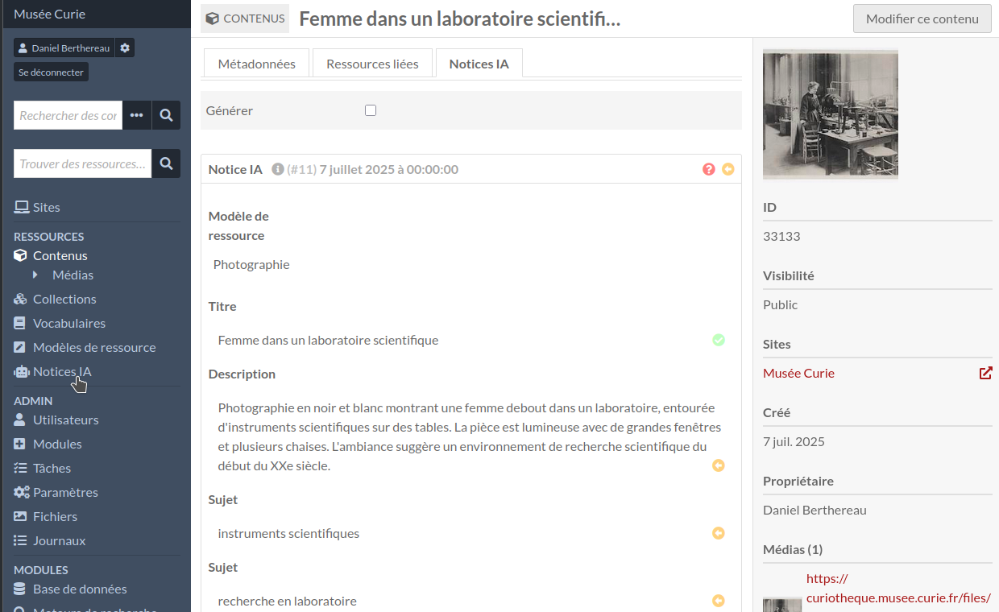

AI Record Generator (module for Omeka S)
========================================

> __New versions of this module and support for Omeka S version 3.0 and above
> are available on [GitLab], which seems to respect users and privacy better
> than the previous repository.__

[AI Record Generator] is a module for [Omeka S] that allows to generate items
metadata automatically via anonymous intelligence (AI). The record is created
by an analysis of image file or url by an external tool. Generated metadata can
be validated automatically or manually by a reviewer. Currently, one generator
is implemented, [ChatGPT] from OpenAI.




Installation
------------

### Module

See general end user documentation for [installing a module].

The modules [Common] and [Advanced Resource Template] must be installed first.

* From the zip

Download the last release [AiGenerator.zip] from the list of releases (the master
does not contain the dependency), and uncompress it in the `modules` directory.

* From the source and for development

If the module was installed from the source, rename the name of the folder of
the module to `AiGenerator`, go to the root of the module, and run:

```sh
composer install --no-dev
```


Usage
-----

### Config

Set the api key for the platform [OpenAI] in the config form.

### Settings

Fill options in the admin settings. This is the default options used in the form
and can be adapted at any time.

An important setting is the prompt. It may contain contextual information to
help the tool to find rights data. It should be in the wanted language, or you
should specify it explicitly.

It may be useful to append the context of the image to get better and more
specific results, for example who is on a photography, the period or the
location.

### Price

The api is free of charge for small images (about < 512px or < 1024px) and a
small number of properties (about < 5). Else, you need to buy tokens.

Warning: the price for tokens for image analysis worths about two tokens for
text and depends on a multiplicator that depends on the model, so currently
about 1.62 to 2.46. The computation is complex and can be changed at any time.

The price depends mainly on the size of the image and on the length of the
prompt, so it is possible to select a derivative image instead of the original.

To create a record costs about $0.01.

### Preparation of the  template

To generate metadata of an item, it should have a template and at least one file
attached as media. The template is required in order to define which properties
should be filled. By default, all properties of the template are fillable, but
some of them may be skipped.

### Single process

A form to process generation is available in the advanced tab of the item form
and in the tab AI Records of the item show view.

- Check the box in the tab "Advanced" of the item form then submit it or save
  the item.
- An automatic prompt is available with properties of the resource template.
  Else, you can configure a specific prompt.

### Bulk process

- Select items to process via an advanced search, then batch edit them.
- In the batch edit form, an automatic prompt is available with properties of
  the resource template. Else, you can configure a specific prompt.
- After process, the admin can go to the resource page of the edited items and
  moderate the values. The values can be accepted as a whole or one by one.
- A page lists lists all generations too. Generation can be marked as reviewed.

### Automatic process

- An option in main settings allows to specify a list of item sets for which the
  generation is done automatically. Simply attach the item to the specified item
  set and save it.

### Validation

- The review can be automatic via the option in the form or in main settings, or
  via a bulk process.
- The review can be manual. It can be done on the whole record or for each value
  individually. Just click on the buttons in the tab AI Records of the resource
  show view.

### Issues

- When the output is not the good one, it is often related to the settings
  "maximum tokens". Try with 10 000 or 100 000 tokens to be sure to get a good
  result with large images, then check the information about the response to
  adjust the default value.
- Some generators don't support multiple images, so check the "primary media only"
  option in that case.


TODO
----

- [ ] Cache the prompt session to avoid to use tokens.
- [ ] Use custom vocabs or tables to specify limited subjects or other fields.
- [ ] Add an option to send existing metadata to the generator for more precise output.
- [x] Add an option to skip validation (so a radio instead of a checkbox in forms). So implement api as response format.
- [ ] Add an option to set a value annotation like "generated". For now, it can be set via module Advanced Resource Template.
- [ ] Use the same display in generated resource / show-details and generated-resource tab in resource / view.
- [ ] Use a three state status for review/reviewed/null.


Warning
-------

Use it at your own risk.

It’s always recommended to backup your files and your databases and to check
your archives regularly so you can roll back if needed.


Troubleshooting
---------------

See online issues on the [module issues] page on GitLab.


License
-------

This module is published under the [CeCILL v2.1] license, compatible with
[GNU/GPL] and approved by [FSF] and [OSI].

This software is governed by the CeCILL license under French law and abiding by
the rules of distribution of free software. You can use, modify and/ or
redistribute the software under the terms of the CeCILL license as circulated by
CEA, CNRS and INRIA at the following URL "http://www.cecill.info".

As a counterpart to the access to the source code and rights to copy, modify and
redistribute granted by the license, users are provided only with a limited
warranty and the software’s author, the holder of the economic rights, and the
successive licensors have only limited liability.

In this respect, the user’s attention is drawn to the risks associated with
loading, using, modifying and/or developing or reproducing the software by the
user in light of its specific status of free software, that may mean that it is
complicated to manipulate, and that also therefore means that it is reserved for
developers and experienced professionals having in-depth computer knowledge.
Users are therefore encouraged to load and test the software’s suitability as
regards their requirements in conditions enabling the security of their systems
and/or data to be ensured and, more generally, to use and operate it in the same
conditions as regards security.

The fact that you are presently reading this means that you have had knowledge
of the CeCILL license and that you accept its terms.


Copyright
---------

* Copyright Daniel Berthereau, 2019-2025 (see [Daniel-KM] on GitLab)

This module is based on the module [Contribute]. The first version was designed
for [Fondation Adlania].

The photography in the screenshot was taken by Henry Manuel in 1913. See the
[Curiothèque] of the [Musée Curie] for more info.


[Omeka S]: https://omeka.org/s
[AI Record Generator]: https://gitlab.com/Daniel-KM/Omeka-S-module-AiGenerator
[Common]: https://gitlab.com/Daniel-KM/Omeka-S-module-Common
[Advanced Resource Template]: https://gitlab.com/Daniel-KM/Omeka-S-module-AdvancedResourceTemplate
[AiGenerator.zip]: https://gitlab.com/Daniel-KM/Omeka-S-module-AiGenerator/-/releases
[installing a module]: https://omeka.org/s/docs/user-manual/modules/#installing-modules
[module issues]: https://gitlab.com/Daniel-KM/Omeka-S-module-AiGenerator/-/issues
[CeCILL v2.1]: https://www.cecill.info/licences/Licence_CeCILL_V2.1-en.html
[GNU/GPL]: https://www.gnu.org/licenses/gpl-3.0.html
[FSF]: https://www.fsf.org
[OSI]: http://opensource.org
[ChatGPT]: https://chatgpt.com
[OpenAI]: https://platform.openai.com
[Contribute]: https://gitlab.com/Daniel-KM/Omeka-S-module-Contribute
[Fondation Adlania]: https://www.fondation-adlania.ch
[Curiothèque]: https://curiotheque.musee.curie.fr/s/fr/item/15162
[Musée Curie]: https://musee.curie.fr
[GitLab]: https://gitlab.com/Daniel-KM
[Daniel-KM]: https://gitlab.com/Daniel-KM "Daniel Berthereau"
